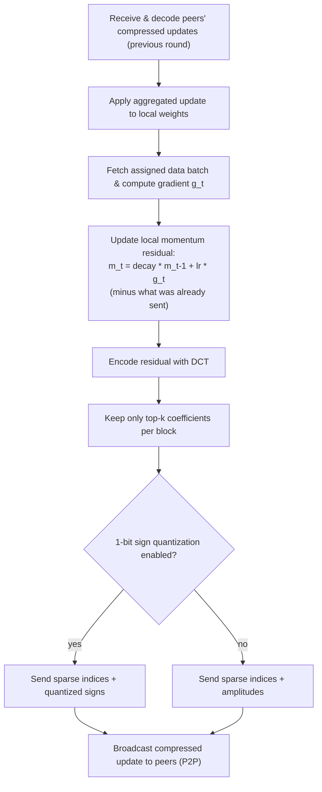

# DisTrO

**DisTrO** (Distributed Training Over the Internet) is the family of training optimizers Psyche uses to make decentralized training practical: it lets a group of untrusted machines across the internet jointly train a large model while exchanging only a small fraction of the data that a conventional data-parallel setup would require.

The name covers a set of optimizer variants; the one used in this codebase lives in `shared/modeling/src/distro.rs` and this chapter explains how it works and how its knobs map to the [run configuration](../enduser/run-config.md).

## The problem: synchronization bandwidth

In synchronous data-parallel training, after every step each trainer must share its gradient update with every other trainer. For a large model this means moving hundreds of megabytes to gigabytes of gradient data per step per trainer — tolerable inside a data center with 400 Gbit fabrics, impossible between arbitrary internet nodes.

DisTrO's insight is that this synchronization traffic is enormously redundant. Two changes make it practical to strip almost all of it out:

1. **Compression via transform**: apply a per-parameter-block transform (here a DCT — Discrete Cosine Transform) that concentrates the meaningful signal of the update into a few large coefficients, then keep only the top-k of those.
2. **Residual accumulation**: instead of communicating the full gradient each step, each node maintains a local *momentum residual* — the portion of past updates it has not yet managed to send. Small components that were dropped by top-k filtering are not lost: they accumulate in the residual and get picked up by later rounds' top-k when they grow large enough.

## How a step works

Here is the local, per-step flow inside the `Distro` optimizer:

Step by step:

1. **Decode peers' updates.** Each node receives its peers' compressed updates (`DistroResult`), batch-decompresses them, applies the inverse DCT, and aggregates them. Because the aggregation is a simple sum of sparse contributions, it does not require a central reducer.
2. **Apply the aggregated update** to local weights. Since every node applies the same aggregate of the previous round, the weight vectors stay synchronized.
3. **Compute the local gradient** on the data batch the [Coordinator](./general-workflow.md) assigned to this node for this round.
4. **Update the local momentum residual.** The residual is decayed (`compression_decay`), the new gradient is folded in, and — crucially — the components that were actually *sent* last round are subtracted back out, so nothing gets double-counted.
5. **Compress.** The residual is encoded with the DCT transform, and only the top-k coefficients per chunk are kept (`compression_topk`, chunks sized by `compression_chunk`). The result is a sparse representation: indices plus values (or, with 1-bit quantization, just the *signs* of the values — one bit per coefficient).
6. **Broadcast.** The compressed update goes out to all peers over the P2P network ([Iroh](./glossary.md)). Everything above happens off-chain; the Solana coordinator only tracks the state machine, data assignments, and witness proofs — never the weight data itself.

The effect: bandwidth per step drops by orders of magnitude compared to shipping raw gradients, which is what allows training to run over the open internet rather than a data-center fabric.

## Where it fits in the run

DisTrO is the "DisTrO Optimizer" box in the [decentralized training flow](./general-workflow.md#decentralized-backend): the Coordinator assigns data batches and witnesses per round, and the optimizer handles all weight synchronization client-to-client. The two systems meet at the round boundary — a round is complete once a [witness quorum](./glossary.md) confirms that the training results for the round's batches have been shared, and the loop advances with the next batch assignments.

## Configuration

DisTrO is selected in the run config through the optimizer definition. The knobs that matter:

| Parameter             | Meaning                                                                                      | Effect of increasing it                                  |
| --------------------- | -------------------------------------------------------------------------------------------- | --------------------------------------------------------- |
| `compression_decay`  | Momentum decay for the local residual (the β of the momentum)                                | More long-range accumulation; updates persist longer      |
| `compression_chunk`  | Target size (in elements) of the chunks the DCT is applied over                              | Larger transform blocks; more global coefficient structure |
| `compression_topk`    | Number of DCT coefficients kept per chunk (the k of top-k)                                   | More faithful updates, more bandwidth per step            |
| `quantize_1bit`      | Replace transmitted amplitudes with just their signs                                         | ~16x less payload per coefficient, slightly noisier updates |

These interact directly with `max_round_train_time` in the [run config](../enduser/run-config.md): the amount of data each node must transfer per round bounds how fast rounds can complete on slow uplinks, so aggressive compression (low `compression_topk`, `quantize_1bit` on) favors geographically distributed fleets.

## Implementations elsewhere

The DisTrO technique was introduced by Nous Research and is also used beyond this Rust codebase — for example in the Python training stack — but the variant this book documents is the Rust implementation in [`shared/modeling/src/distro.rs`](https://github.com/PsycheFoundation/nousnet/blob/main/shared/modeling/src/distro.rs) (see `Distro`, `TransformDCT`, and `CompressDCT`), with the wire format for its compressed results in `shared/network/src/serialized_distro.rs` and a CLI tool to expand/inspect them in `tools/rust-tools/expand-distro`.
