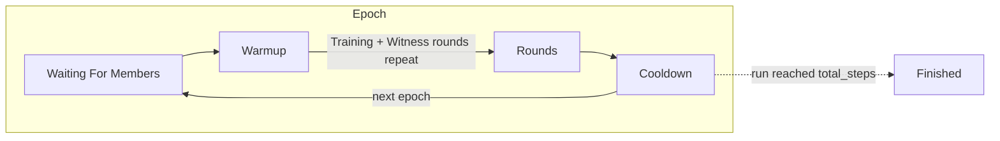

# Node Operator Guide

This chapter is a field manual for people who operate Psyche training nodes — whether you are providing compute to an existing run, keeping a machine healthy across long training jobs, or trying to understand what your node is doing between epochs.

If you have never run a node before, start with the [Quickstart: Compute Provider](../enduser/quickstart-compute-provider.md). This guide assumes you already have a working node and focuses on operating it over time: lifecycle, epoch boundaries, monitoring, maintenance, and recovery.

## What a node operator actually operates

A Psyche node consists of a few cooperating pieces:

| Piece                    | What it is                                                                 | Who manages it                          |
| ------------------------ | -------------------------------------------------------------------------- | --------------------------------------- |
| `run-manager`            | The supervisor binary that resolves the run, pulls the image, starts/stops the client container | You                                     |
| Client container         | The Docker image (`nousresearch/psyche-client`) that runs the actual training software | Pulled automatically by `run-manager`   |
| Solana keypair           | Your node's on-chain identity, used for joins, transactions, and reward claims | You (keep it secret, keep it backed up) |
| RPC endpoints           | Your Solana RPC/WebSocket providers (primary + fallback)                    | You or your RPC provider                |
| GPU + drivers            | NVIDIA GPU, drivers, Docker, and the NVIDIA Container Toolkit              | You                                     |

One important thing to understand: **the client image is managed for you, but the host is not.** When a run upgrades its client version, `run-manager` pulls the new tag and restarts the container; when a new *run-manager* version is required, that is a manual step for you as the operator.

## Node lifecycle from the operator's seat

From the outside, a healthy node looks like a sequence of epochs. Each epoch is one full pass through the run's phase machine:



As an operator you don't drive these transitions — the [Coordinator](../explain/general-workflow.md) does — but each phase has a different failure mode, and knowing which one you are in makes logs much easier to read:

| Phase                | What your node is doing                                                             | Typical operator-side failures                                       |
| -------------------- | ----------------------------------------------------------------------------------- | -------------------------------------------------------------------- |
| **WaitingForMembers** | Waiting for enough authorized clients (`min_clients`) to join before the epoch starts | Wallet not authorized for the run; pending list not clearing           |
| **Warmup**           | Downloading/loading the model onto the GPU (first epoch from a hub checkpoint, later epochs via P2P from peers) | Slow hub download; insufficient VRAM; peers unreachable for P2P fetch |
| **Training (RoundTrain)** | Training on the data batches the coordinator assigned to you                 | Insufficient disk/data provider timeouts; GPU too slow for round time |
| **Witness (RoundWitness)** | Witnesses collect and confirm other clients' training results; everyone catches up on missed results | Too few witnesses for quorum — round may repeat                         |
| **Cooldown**         | Checkpointing to external storage and preparing the next epoch                       | Checkpoint upload failure; epoch state reset visible in logs          |

### Reading epoch boundaries in your logs

The most important events to watch for:

1. **`WaitingForMembers` entered** — your client is a pending member if it just joined. Clients can join a run at any moment; you will remain pending and start training in the next epoch.
2. **`Warmup` entered** — your client begins model download. First epoch downloads the base checkpoint (e.g. from Hugging Face); subsequent epochs fetch the model from other peers over P2P.
3. **`Cooldown` entered** — the epoch is ending. Checkpointers save the model state to external storage; the coordinator resets the checkpoint mode to P2P for the next epoch.
4. **Next epoch begins** — clients that survived the epoch automatically rejoin unless they exited or were ejected.

If you see your client repeatedly cycle through the same short window without ever reaching `Cooldown`, that usually means the run is below `min_clients` or witnesses are not reaching quorum — this is a run-level property, not something wrong with your machine.

### Rewards accrue per completed epoch

The Coordinator tracks each client's compute contribution. A client is rewarded at the end of an epoch **only if it successfully completed the whole epoch**. Reward "points" are shared equally among all finishing clients of that epoch, and points can later be claimed against the [Treasurer](../explain/rewards.md) if the run has one.

Practical consequences:

- Leaving mid-epoch (crash, reboot, `Ctrl+C`) forfeits that epoch's rewards — you re-enter as a pending client in the next epoch.
- Multiple machines must use **different keypairs** (see [Delegation and multi-machine setups](#delegation-and-multi-machine-setups)).
- Claim accumulated points with `run-manager treasurer-claim-rewards` (see [Claiming rewards](#claiming-rewards-and-points)).

## Running a node long-term

### Session management

Training epochs can run indefinitely. Run the node inside a session that survives disconnects (`tmux`, `screen`, a systemd unit):

```bash
tmux new -s psyche
./run-manager --env-file ~/.config/psyche/run.env
# detach: Ctrl+B then D; reattach: tmux attach -t psyche
```

For production nodes, a systemd unit is a good pattern:

```ini
# /etc/systemd/system/psyche-node.service
[Unit]
Description=Psyche training node
After=docker.service network-online.target
Wants=network-online.target

[Service]
User=psyche
Restart=on-failure
RestartSec=15
WorkingDirectory=/opt/psyche
ExecStart=/opt/psyche/run-manager --env-file /opt/psyche/run.env

[Install]
WantedBy=multi-user.target
```

### Startup checklist

Before each (re)start, verify the core dependencies — all of these failing look like "container keeps restarting" from a distance:

```bash
nvidia-smi                                                     # GPU + driver visible
docker run --rm --gpus all nvidia/cuda:12.2.2-base-ubuntu22.04 nvidia-smi  # GPU visible inside Docker
docker pull hello-world                                        # Docker Hub reachable
solana balance ~/.config/solana/psyche-node.json               # Wallet funded (devnet: solana airdrop 2)
df -h                                                          # Disk space for model checkpoints & images
```

Wallet funds matter even on runs without rewards: the wallet pays Solana transaction fees (join, tick, witness messages). A wallet that runs out of SOL mid-epoch will silently stall.

### Monitoring what matters

Things worth checking periodically:

- **Container status:** `docker ps` — container should stay up, not flap. Use `docker logs -f CONTAINER_ID` to stream logs if `run-manager` exits.
- **Phase transitions in logs** — see [Reading epoch boundaries](#reading-epoch-boundaries-in-your-logs). Absence of transitions = stalled run or stalled node.
- **GPU utilization:** `nvidia-smi` (or `watch -n1 nvidia-smi`) — during Training phases the GPU should be busy; long idle stretches during Training usually mean data fetch problems.
- **Disk:** checkpoints and images are large; a full disk mid-epoch corrupts your local state.
- **RPC health:** both primary and fallback (`RPC_2`/`WS_RPC_2`) endpoints — a dead RPC makes a healthy node look dead.

### Checking run state from the command line

`run-manager` ships with read-only commands that query the coordinator directly — useful when logs are ambiguous or the container is down:

```bash
# Which runs exist and are joinable (optionally filtered by authorizer)
run-manager list-runs --env-file ~/.config/psyche/run.env

# Full JSON state of a run: phase, epoch/step progress, per-client
# earned/slashed points, epoch rates, and treasurer escrow health
run-manager json-dump-run \
    --rpc [RPC] \
    --run-id [RUN_ID]

# Your own status in a run: current client record, epoch membership,
# earned points, and what you have already claimed from the treasurer
run-manager json-dump-user \
    --rpc [RPC] \
    --run-id [RUN_ID] \
    --address YOUR_PUBLIC_KEY
```

`json-dump-run` is the fastest way to answer "is it my node or the run?" — if the run's `status.state` shows `Paused` or `WaitingForMembers` while your container looks busy, the run itself is waiting on something (members, pause, or a halted config update), not your machine.

### Updating

- **Client container:** handled automatically — `run-manager` detects the run's client version and pulls the correct image tag. To force it: `docker pull nousresearch/psyche-client:latest`.
- **run-manager:** manual. When a run upgrades to a protocol version your `run-manager` doesn't support, you will typically see "version mismatch" loops — that is your cue to obtain the updated binary and restart.

A restarting container with a version-mismatch loop is almost never your GPU's fault — it means image pull or protocol version negotiation is failing.

## Maintenance windows and graceful exit

The best moment to stop a node for maintenance is **right after an epoch ends** (during the early `WaitingForMembers`/`Warmup` window of the next epoch), because:

- you keep the previous epoch's reward points,
- the next epoch will start without you anyway if it must wait for members, and
- model state is safely checkpointed in external storage.

To stop: `Ctrl+C` in the `run-manager` terminal (or `docker stop` if detached). If the process is hung, check `docker ps` and force-stop the container manually. Your client state becomes `Withdrawn` and you can rejoin at any time — you will be a pending client until the next epoch begins.

Avoid stopping mid-`Cooldown` — that is when the checkpoint your next epoch depends on is being written/uploaded.

## Delegation and multi-machine setups

One keypair per machine, always. Running the same keypair on multiple machines simultaneously will cause problems. Psyche's delegation system is designed for exactly this:

1. Your master keypair (the one the run admin authorized) stays on machine #1 (or in cold storage).
2. Generate a delegate keypair per additional machine: `solana-keygen new --outfile ~/.config/solana/psyche-delegate-1.json`.
3. Register delegates under the master key with `run-manager join-authorization-delegate` (ask the run administrator for the `JOIN_AUTHORITY_PUBKEY`).
4. Each additional machine sets `WALLET_PRIVATE_KEY_PATH` to its own delegate keypair and `AUTHORIZER` to the **master** public key.
5. Fund each delegate wallet with SOL for fees.

This also works well for cloud-burst setups — spawn delegates on ephemeral GPUs, destroy them, and your reward identity (the master key) never changes.

## Claiming rewards and points

After completing epochs on a run with a Treasurer, claim accrued points:

```bash
run-manager treasurer-claim-rewards \
    --rpc [RPC] \
    --run-id [RUN_ID] \
    --wallet-private-key-path [JSON_PRIVATE_KEY_PATH]
```

Points are per-epoch, per-run, and only for clients that finished the whole epoch — see [Rewards](../explain/rewards.md) for how the Treasurer escrow and the Mining Pool interact.

## Troubleshooting quick reference

| Symptom                                                     | Likely cause / first check                                                        |
| ----------------------------------------------------------- | -------------------------------------------------------------------------------- |
| Container restarts every few seconds, "version mismatch"    | Image pull/protocol negotiation — check network, `docker pull hello-world`, disk   |
| `could not select device driver "" with capabilities: [[gpu]]` | NVIDIA Container Toolkit missing/misconfigured — run the GPU-in-Docker check     |
| `Failed to read wallet file`                                 | `WALLET_PRIVATE_KEY_PATH` wrong or file missing — `ls -l` the path                |
| `RPC error: failed to get account` / timeouts                | RPC provider down or rate-limited — switch to `RPC_2`, or use a dedicated provider |
| Authorization errors on join                                 | Run admin hasn't authorized your pubkey — `run-manager can-join` to verify        |
| No logs, seems stuck                                         | `docker ps` + `docker logs`; check run state via coordinator (run may be Paused)  |
| GPU idle during Training phase                                | Data provider slow/unreachable; check disk and network throughput                |
| Lost rewards unexpectedly                                    | Client left/dropped mid-epoch; check for OOM/crashes around the epoch boundary    |

For client-level errors not covered here, see the [Client FAQ](../enduser/client-faq.md) and the [Joining a run troubleshooting section](../enduser/join-run.md#troubleshooting).
